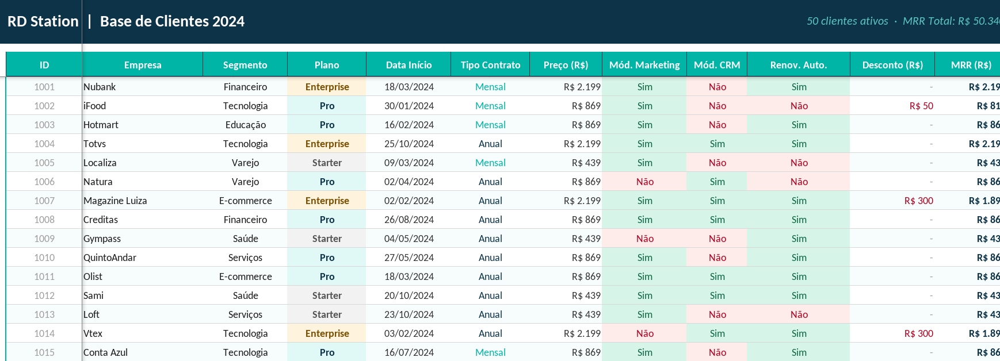
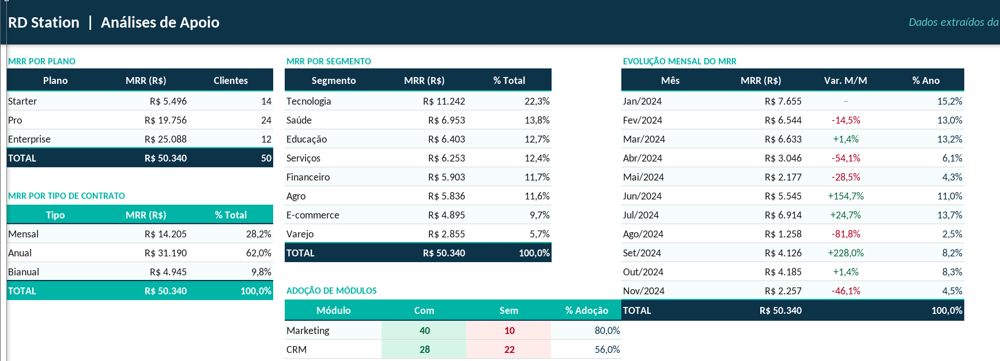
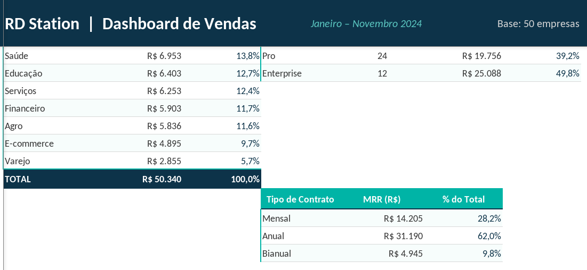
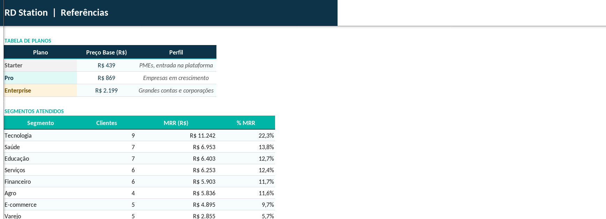

# 📊 RD Station Sales Dashboard

*Dashboard de acompanhamento de assinaturas SaaS baseado em dados de vendas da RD Station.*

## 🖼️ Visão Geral do Dashboard

| Overview | Analytics |
| :---: | :---: |
|  |  |
| **Sales** | **References** |
|  |  |

## 🎯 Objetivo
Desenvolver um painel de BI para monitorar métricas críticas de assinaturas (SaaS), facilitando a tomada de decisão estratégica baseada em dados.

## 📈 Principais KPIs Analisados
- **Receita Recorrente Mensal (MRR):** Evolução das assinaturas.
- **Taxa de Conversão:** Desempenho do funil de vendas.
- **Churn Rate:** Análise de cancelamentos.

## 🛠 Ferramentas Utilizadas
- **Microsoft Excel:** Processamento de dados e construção dos gráficos.
- **Microsoft Copilot:** Auxílio na estruturação das fórmulas e insights analíticos.

## 🚀 Como visualizar
1. Faça o download do arquivo `rd_station_dashboard.xlsx` na pasta de dados.
2. Abra no Microsoft Excel ou Power BI.
3. Explore as abas de "Dashboard" para ver os filtros interativos.
